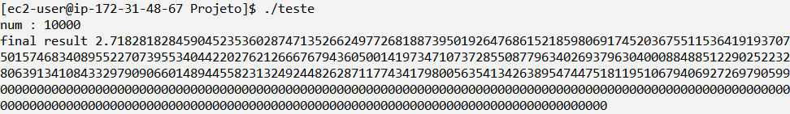
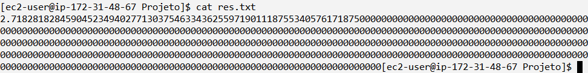

# Projeto

Gabriel de França Marques - 42107490 \
Renan Luiz Rodrigues Tagliaferro - 42105846

Este projeto visa desenvolver um algoritmo para estimar o valor de 'e' (número de Euler) por meio de uma série infinitesimal. O algoritmo realiza a soma de frações para aproximar 'e' da seguinte forma:

### Implementação inicial: 
Será desenvolvida uma solução para calcular 'e' considerando o maior valor possível para 'n' no denominador da fórmula. A solução usará pelo menos dois núcleos de processamento para computação paralela.

### Registro do valor de 'e': 
O valor obtido para 'e' e valide o número de casas decimais corretas para avaliar a precisão da estimativa.

### Cálculo do Speedup: 
Calcule e registre o speedup obtido ao migrar para a versão paralela do algoritmo. O speedup é a medida da melhoria de desempenho ao utilizar múltiplos núcleos de processamento.

# Número 'e'
O valor de Euler que será obtido para a conferência da precisão foi obtido no site do Astronomy Picture of the Day - NASA, onde é armazenado o número de Euler até com 1 milhão de dígitos de precisão. Localizado em: https://apod.nasa.gov/htmltest/gifcity/e.1mil. \
Segue o número obtido no site com 200 dígitos decimais: 
```
2.71828182845904523536028747135266249775724709369995957496696762772407663035354759457138217852516642742746639193200305992181741359662904357290033429526059563073813232862794349076323382988075319525101901
```

# Execução do código
### Serial
A execução do código serial gerou um número com 37 casas decimais de precisão:


Saída res.txt:


Tempo de execução com o comando ``perf stat -r 1 ./teste``: 31.989403809 segundos

### Paralela
A execução do código paralelo gerou um número com 17 casas de precisão:


Saída res.txt:


Tempo de execução com o comando ``perf stat -r 1 ./eparalelo 2``: 26.099513927 segundos


# Speedup da Máquina rodando com 2 threads
Pela Lei de Amdahl Sp = T(1)/T(p), e lembrando que na execução foram utilizadas 2 Threads:

```sp = 31.989403809/26.099513927```

sp = 1.225670481775023 bom ganho de desempenho em relação à versão serial quando executado em máquina multicore.

