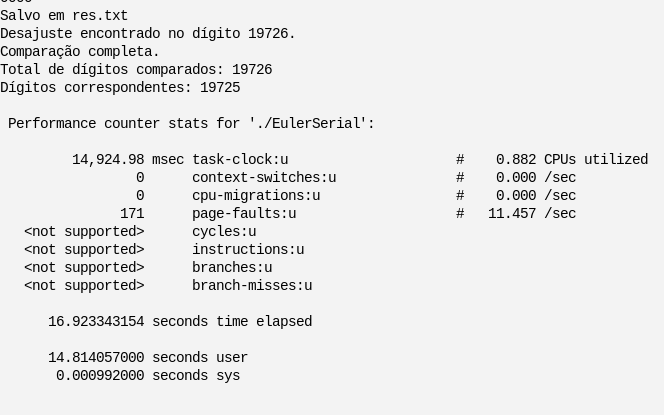

# Projeto Final

Gabriel de França Marques - 42107490 \
Renan Luiz Rodrigues Tagliaferro - 42105846

Este projeto visa desenvolver um algoritmo para estimar o valor de 'e' (número de Euler) por meio de uma série infinitesimal. O algoritmo realiza a soma de frações para aproximar 'e' da seguinte forma:

### Implementação inicial: 
Será desenvolvida uma solução para calcular 'e' considerando o maior valor possível para 'n' no denominador da fórmula. A solução usará pelo menos dois núcleos de processamento para computação paralela.

### Registro do valor de 'e': 
O valor obtido para 'e' será validado com o número 'e' obtido externamente para avaliar a precisão da estimativa.

### Cálculo do Speedup: 
Calcule e registre o speedup obtido ao migrar para a versão paralela do algoritmo. O speedup é a medida da melhoria de desempenho ao utilizar múltiplos núcleos de processamento.

# Número 'e'
O valor de Euler que será obtido para a conferência da precisão foi obtido no site do Astronomy Picture of the Day - NASA, onde é armazenado o número de Euler até com 1 milhão de dígitos de precisão. Localizado em: https://apod.nasa.gov/htmltest/gifcity/e.1mil. \
Segue o número obtido no site com 200 dígitos decimais: 
```
2.71828182845904523536028747135266249775724709369995957496696762772407663035354759457138217852516642742746639193200305992181741359662904357290033429526059563073813232862794349076323382988075319525101901
```

Para comparação devida, o número foi copiado inteiramente para o arquivo ``num.txt``. Uma função no código fará o trabalho de analisar quantas casas decimais obtidas no arquivo de saída (``res.txt``) correspondem ao valor em ``num.txt``.

# Compilação do código
O código deverá ser compilado com diretrizes especiais devido ao uso do OpenMP e do GMP (biblioteca que permite a alocação de variáveis com valores elevados). Primeiro o GMP deverá ser instalado:

Instalação em Fedora/RHEL:
```sudo dnf install gmp-devel```

Com a instalação completa, os códigos que fazem uso do GMP poderão ser compilados:
```gcc -fopenmp -lgmp input.c -o output```

# Como o problema foi resolvido?
Para calcular o número de Euler com múltiplos dígitos de precisão, foram utilizadas múltiplas threads para agilizar o processo, além de implementar mutex para evitar condições de corrida no código. Além disso, devido ao ``print`` da Linguagem C apresentar alguns problemas de precisão, programamos para que a saída seja feita num arquivo chamado ``res.txt```. Quanto aos números de alta precisão, foi utilizada a biblioteca GMP (GNU Multiple Precision Arithmetic Library), permitindo que seja possível trabalhar com números longos.

### Resumidamente, como funciona o GMP?
O GMP aloca espaço para suas variáveis internamente. Floats no GMP utilizam um expoente e uma mantissa. Pedaços de um número multi-precisão que podem ser armazenados num tipo WORD são denominados _limbs_ (membros), com o uso de _limbs_, é possível realizar lidar com situações de carry em cálculos.

Fonte: 

# Tempo e speedup da serial para paralela
Os tempos de execução foram obtidos com o comando ``perf stat ./arquivoCompilado``

### Serial para n = 20000 (20 mil):

16,923343154s (0,28min)




### Paralelo para n = 20000 (20 mil):

9,995086440s (0,16min)


### Serial para n = 100000 (100 mil):

474,720885957 (7,90min)


### Paralelo para n = 100000 (100 mil):

261,597125601 (4,35min)


Speedup calculado para n = 20000:
``1,6931662628``

Speedup calculado para n = 100000:
``1,8147022252``

## Dados da primeira versão para comparação:
### Serial para n = 20000 (20 mil):

241,937456717s (4,03min)


### Paralelo para n = 20000 (20 mil):

213,788904690s (3,56min)


### Serial/Paralelo para n = 100000 (100 mil):
Rodando pela AWS, os códigos da primeira versão não foram capazes de obter uma saída após a conclusão de um timer externo de 30 minutos. A execução foi cancelada e os valores de speedup obtidos são em relação à execução com n = 20000.

Imagem da execução interrompida com CTRL + C:


Speedup calculado para n = 20000:
``1,13166516788``


# Estratégia de paralelismo
No primeiro código, foi implementada a paralelização usando a biblioteca OpenMP. A abordagem central envolve dividir a carga de trabalho entre diversas threads por meio de um loop paralelo. Cada thread calcula um resultado parcial de forma independente, e a thread principal agrega esses resultados parciais para obter o resultado final. A seção crítica é empregada para garantir que múltiplas threads possam atualizar a variável de resultado compartilhada sem conflitos.
Na segunda versão, uma estratégia diferente de paralelização foi adotada. Foram utilizados pthreads (threads POSIX), em que um conjunto de threads é criado, sendo cada uma responsável por uma faixa específica de cálculos. A tarefa é dividida entre as threads, e cada uma delas calcula um resultado parcial. Posteriormente, a thread principal espera pela conclusão de todas as threads e consolida os resultados parciais.

Algumas características distintivas na segunda versão incluem:

- Conjunto de Threads: A segunda versão cria explicitamente um conjunto de threads usando pthread_create e aguarda pela conclusão dessas threads com pthread_join.

- Função das Threads: Cada thread executa a função threadFunction, a qual calcula uma parte do resultado total. Essa função é responsável por uma faixa de cálculos especificada pelos campos start e end na estrutura ThreadData.

- Inicialização da Precisão e do Resultado: As variáveis de precisão e resultado são inicializadas com uma precisão mais alta (65536 bits) para garantir maior exatidão nos cálculos.

- Comparação com o Euler Real: O código inclui uma função (compareWithActualEuler) para comparar o resultado com um valor conhecido do número de Euler. Essa função lê dígitos de dois arquivos e os compara, fornecendo informações sobre possíveis discrepâncias.

Em resumo, ambas as versões empregam técnicas de paralelização para distribuir a carga de trabalho entre múltiplas threads, mas utilizam mecanismos de paralelização diferentes (OpenMP na primeira versão, pthreads na segunda versão). A segunda versão também apresenta recursos adicionais, como um conjunto de threads, gerenciamento explícito de threads e uma função para a comparação do resultado com um valor conhecido.

# Execução do código
Tanto a execução do código Serial quanto ao Paralelo geram o mesmo número de casas precisas: 19725

### Serial:


### Paralelo:


