Os programas foram escritos em c++, para compilar, utilizamos o g++ no linux

### EX1: 

### EX2:
]

### EX3:
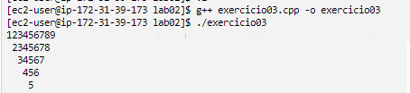

### EX4:
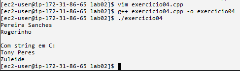

### EX5:
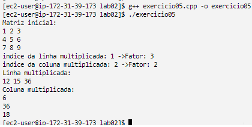

### EX6:
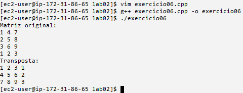

### EX7:
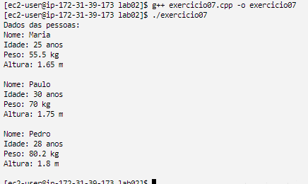

### EX8:
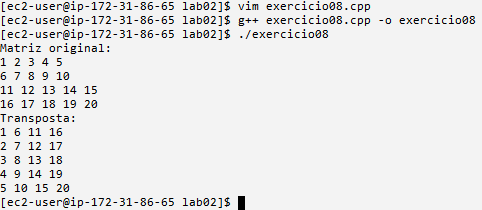

### EX9:
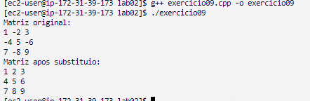

### EX10:
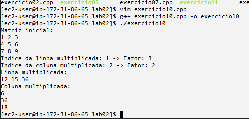

### EX11:
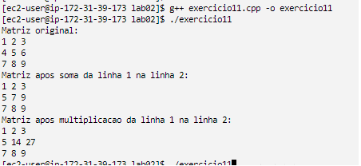

### EX12:

### EX13:
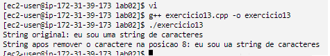

### EX14:
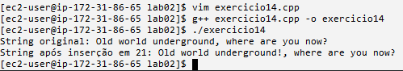
