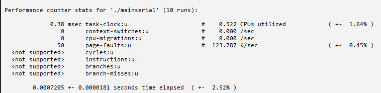
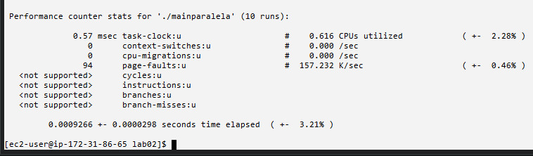
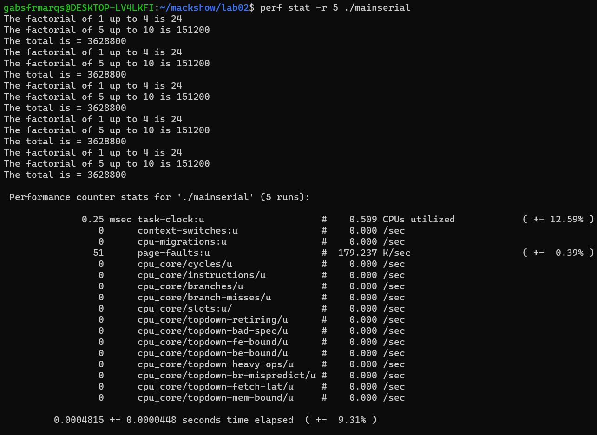
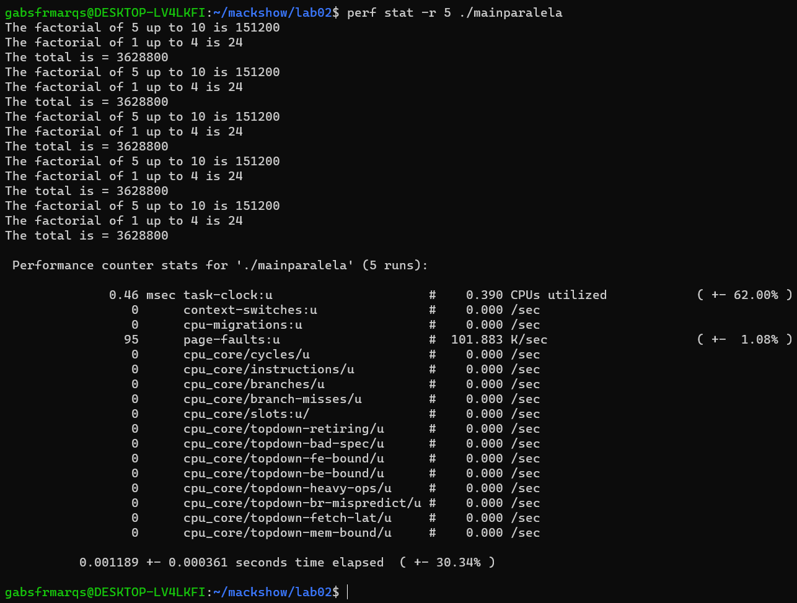

# Laboratório 02 - Processos

Não conseguimos atingir performance superior com o código paralela pela AWS. A execução serial apresentou execução mais rápida em todos os casos. \
Por desencargo de consciência, um segundo teste foi realizado via WSL2 no Windows 11 numa máquina com um Core i5-12500T com 6c/12t. Nele a execução do código em paralelo demonstrou ser mais rápida que a execução do código serial.

## Execuções na AWS
### Serial

### Paralelo

 
 
## Execuções no Windows Terminal (WSL2 rodando Debian)
### Serial

### Paralelo

