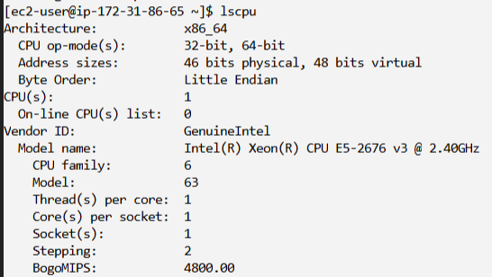
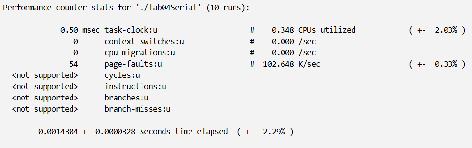
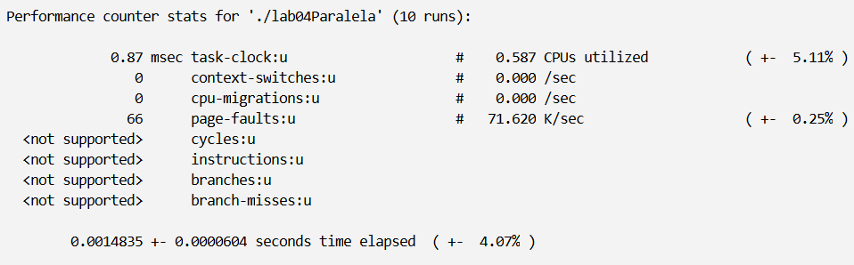
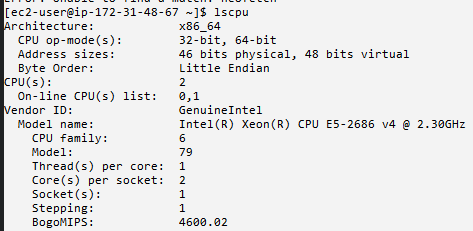
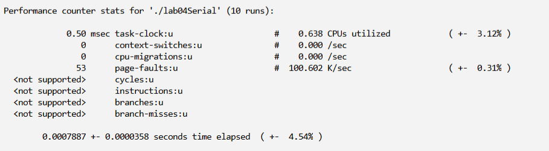

# LAB04

Considere o trecho de código fornecido para resolver o problema da multiplicação matriz-vetor utilizando pthreads. 
Construa a versão serial e paralela e registre os tempos de execução e speedup no repositório do projeto.

<--  -->
<-- Codigo de compilacao: ```gcc pthread.c -o helloworld -Wall -lpthread``` -->
<-- Execuçao: ```./helloworld <threads>``` -->

## Máquina original
### lscpu


### Execução serial


### Execução paralela


## Máquina 2vCPU
### lscpu


### Execução serial


### Execução paralela

