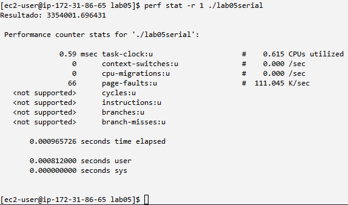
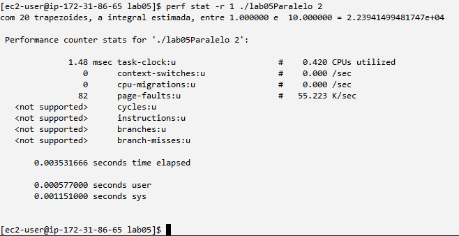
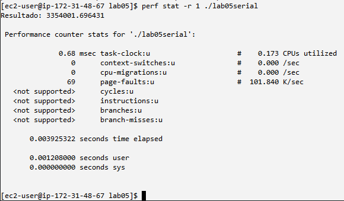
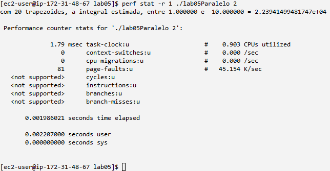

# Laboratório 05 - Parte 1

Esta pasta também contem o Hello World Paralelo mostrado em aula, que apesa de não fazer parte da entrega, demonstra que entendemos o conceito da matéria.

Os aquivos com nome lab05 são os pedidos na entrega, para compilá-los e executá-los use os comandos abaixo, lembrando que o -lm é necessário para a biblioteca math compilar corretamente.

compilar arquivo serial: 

gcc lab05serial.c -o lab05serial -lm

executar aquivo serial:

./lab05serial

compilar arquivo paralelo:

gcc lab05Paralelo.c -fopenmp -o lab05Paralelo -lm

executar arquivo paralelo: nome do executável, espaço, número de threads desejadas:

./lab05Paralelo 5

# Execuções na AWS
## Máquina 1vCPU
### Execução serial

### Execução paralela

## Máquina 2vCPU
### Execução serial

### Execução paralela

